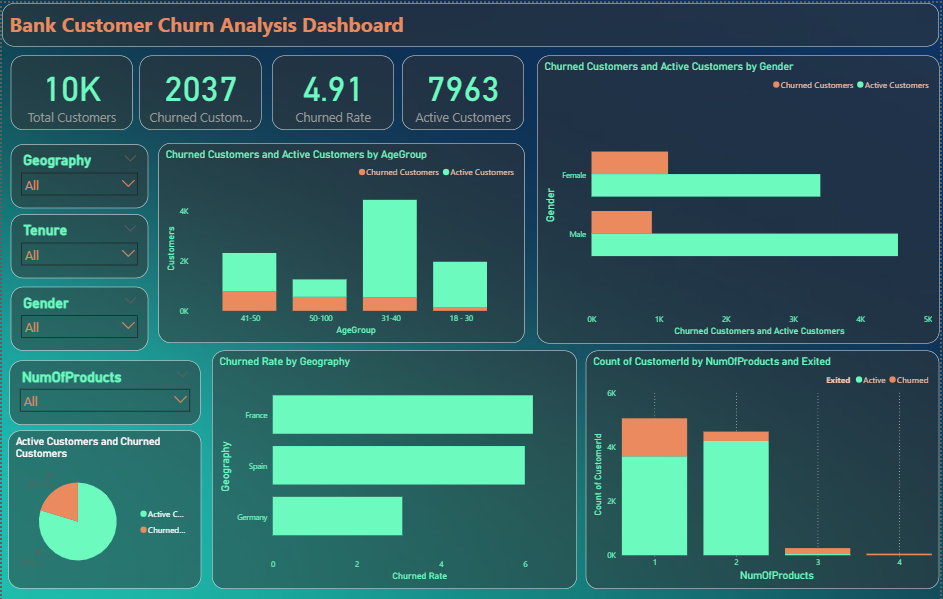

# 🏦 Bank Customer Churn Analysis Dashboard (Power BI)

## 📊 Overview
Developed an interactive Power BI dashboard to analyze customer churn patterns in a retail banking dataset. The project focuses on identifying key factors influencing churn and provides actionable insights to improve customer retention.

## 🧠 Key Insights
- Analyzed customer demographics and banking behavior to identify **high-risk churn groups**.  
- Discovered that customers with **low credit scores**, **shorter tenure**, and **low balance** had higher churn probabilities.  
- Created KPIs for **Churn Rate**, **Average Balance**, and **Customer Tenure**.  
- Designed visuals for **gender-based churn**, **geography trends**, and **age group distributions**.  

## 🛠️ Tools & Techniques
Power BI • DAX • Data Cleaning • Data Modeling • Business Analytics • Visualization Design

## 📸 Dashboard Preview

## 📁 Files Included
- `Bank_Customer_Churn_Analysis.pbix` — Power BI project file  
- `dashboard_preview.png` — Dashboard snapshot  
