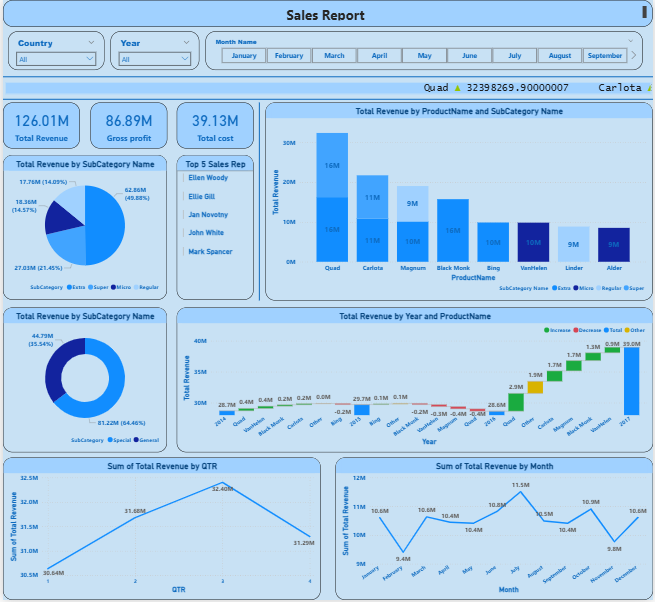

# 📊 Sales Report Dashboard (Power BI)

## 🧠 Overview
An interactive Power BI dashboard analyzing real-world sales data across multiple regions, products, and time periods. The dashboard provides actionable insights into revenue performance, profit margins, and sales representative productivity.

## 🚀 Key Insights
- Visualized **Total Revenue (₹126M)** and **Gross Profit (₹86.9M)** with regional breakdowns.
- Identified **top-performing products and sales reps** using DAX measures.
- Integrated dynamic filters for **country**, **year**, and **month**.
- Highlighted **quarterly sales trends** and **category-level performance**.

## 🛠️ Tools & Techniques
Power BI • DAX • Data Modeling • Data Cleaning • Visualization Design • Business Analytics

## 📸 Dashboard Preview

## 📁 Files Included
- `Sales_Report.pbix` — Power BI project file  
- `dashboard_preview.png` — Dashboard snapshot 
